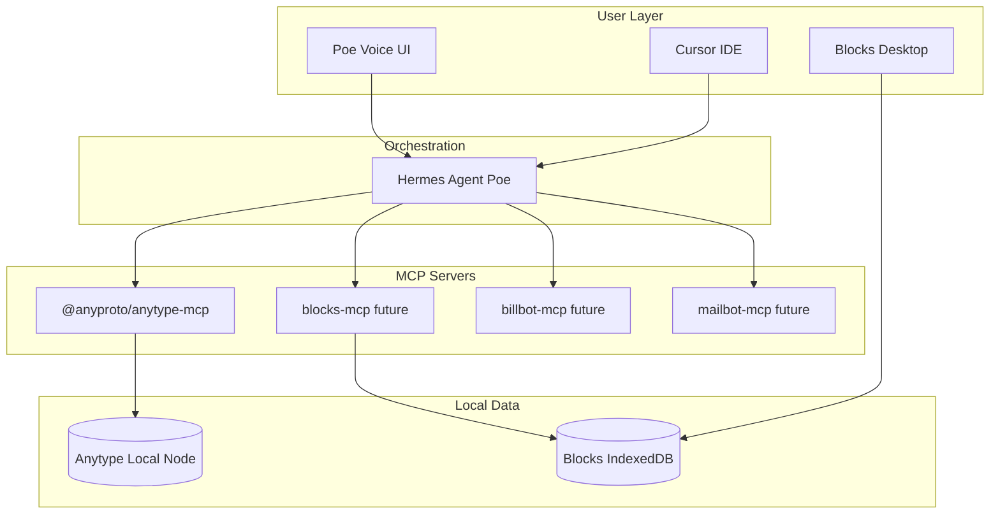

# Hermes AI Ecosystem Architecture (PoweredUpLabs)

> Planning document for v0.0.3 — local-first "Jarvis-style" agent orchestration

## Executive Summary

**Recommendation: Separate repos per product, unified via MCP (Model Context Protocol).**

Do not merge Blocks, BillBot, Mailbot, Poe, and Anytype integrations into one monolithic codebase. Each product keeps its own lifecycle, deployment, and UI. **Poe (Hermes Agent)** acts as the orchestration layer that connects them through MCP servers.

## Product Map

| Project | Role | Repo Strategy |
|---------|------|---------------|
| **Poe** | Central Hermes AI home assistant / orchestrator | Separate repo (`PoweredUpLabs/Poe`) |
| **Blocks** | Time management, timeline, kanban | This repo (`PoweredUpLabs/Blocks`) |
| **BillBot** | Billing and invoicing automation | Separate repo |
| **Mailbot** | Email sorting and automation | Separate repo |
| **Anytype** | Knowledge base + integrations hub | External (Anytype app + MCP) |

## Why MCP-First (Not Monorepo)

1. **Independent shipping** — Blocks v0.0.3 can release without waiting on BillBot.
2. **Clear boundaries** — Each bot exposes typed tools; Hermes routes requests.
3. **Local-first** — Anytype MCP runs against `localhost:31009`; Hermes runs locally.
4. **Cursor billing** — Hermes Cursor provider (`hermes auth add cursor`) uses your Cursor subscription for model access without per-app API keys.

## Architecture Diagram

## Integration Phases

### Phase A — Foundation (v0.0.3, this sprint)
- [x] Document architecture (this file)
- [ ] Configure Anytype MCP in Cursor (see `docs/INTEGRATIONS_ANYTYPE_MCP.md`)
- [ ] Configure Hermes + Cursor provider (see `docs/INTEGRATIONS_HERMES_CURSOR.md`)
- [ ] Manual validation: "Add a Blocks-style task note in Anytype"

### Phase B — Blocks MCP Server (v0.0.3) ✅
- [x] Create `@blocks/mcp-server` package exposing timeline/kanban tools
- [x] Register in `.cursor/mcp.json.example` alongside Anytype MCP

### Phase C — Cross-Bot Workflows (v0.1.0)
- [ ] BillBot MCP: invoice status, create invoice
- [ ] Mailbot MCP: summarize inbox, triage
- [ ] Poe orchestration prompts: "Plan my day from Anytype + Blocks"

## Hermes vs Cursor: Who Does What?

| Concern | Tool |
|---------|------|
| Model access + billing | Hermes with Cursor provider OR Cursor directly |
| Anytype read/write | `@anyproto/anytype-mcp` |
| Blocks task ops | Future `blocks-mcp` |
| Dev-time coding | Cursor IDE |
| Runtime home assistant | Hermes Agent (Poe) |

**Hermes does NOT replace Blocks UI.** Users still interact with Blocks Desktop for timeline/kanban. Hermes handles natural-language automation across tools.

## Decision Log

| Date | Decision | Rationale |
|------|----------|-----------|
| 2026-06-09 | Separate repos + MCP | Flexibility, solo-founder velocity |
| 2026-06-09 | Poe as separate project | Jarvis scope exceeds Blocks; avoid coupling |
| 2026-06-09 | Windows Desktop first | Primary daily driver; mobile/Expo on hold |
| 2026-06-09 | Anytype via official MCP | Stable API; no custom fragile wrappers |

## Next Actions

1. Set up Anytype API key + MCP (Priority 2)
2. Install Hermes Agent locally; `hermes auth add cursor`
3. Prototype Blocks MCP in v0.0.4 sprint
4. Keep BillBot/Mailbot in their own repos until MCP stubs exist
