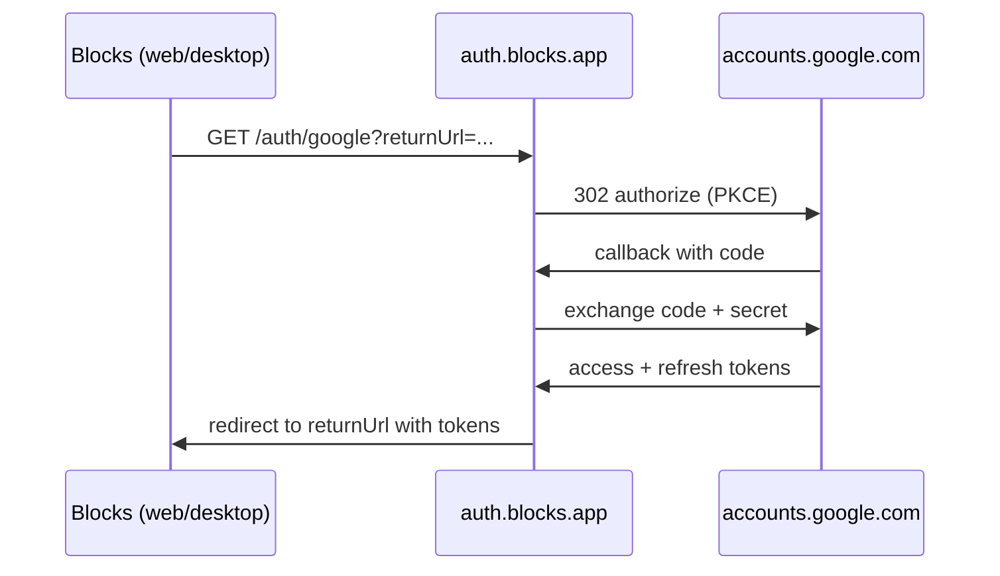

# Google OAuth — Retail Rollout

> How Blocks Google Calendar sign-in works, why a hosted proxy exists, and the checklist to ship **Outlook-simple** connect for retail users.

**Related:** [LOCAL_FIRST_ARCHITECTURE.md](./LOCAL_FIRST_ARCHITECTURE.md) · [oauth-proxy README](../../apps/oauth-proxy/README.md) · [N-0023](../Working%20Docs-Features-Incidents/ROADMAP.md#n-0023-retail-google-oauth) · [B-0017](../Working%20Docs-Features-Incidents/INCIDENTS.md#b-0017-desktop-google-connect-shows-localhost)

---

## TL;DR

| Audience | What they experience |
|----------|----------------------|
| **Retail user** | Tap **Connect Google** → Google account picker → consent → back in Blocks. No localhost, no terminals. |
| **Developer** | Run `pnpm --filter @blocks/oauth-proxy dev`, set `apps/oauth-proxy/.env`, connect from web/desktop on localhost. |
| **Operator** | Deploy `apps/oauth-proxy` to `https://auth.blocks.app` (or your domain), register Google OAuth redirect URIs, set env in Vercel + app builds. |

---

## Why not “straight to Google” like Outlook?

Outlook (and Slack, Notion, etc.) **does** send you straight to Google — but they run a **hosted auth backend** that holds the OAuth **client secret**. Google never gives that secret to a desktop installer or browser bundle; anyone could extract it.

Blocks is **local-first**: tasks live in IndexedDB on the device. The only server is a tiny **OAuth proxy** that:

1. Starts OAuth (PKCE) and redirects to `accounts.google.com`
2. Receives Google’s callback at a fixed HTTPS URL
3. Exchanges the auth code using the client secret (server-side only)
4. Redirects back to the app with tokens (hash, query, or `blocks://`)

**Retail users never run the proxy locally.** `localhost:8787` is the **developer default** when the hosted URL is not configured.



---

## Current status (your machine)

If you ran `pnpm --filter @blocks/oauth-proxy dev`:

```bash
curl http://localhost:8787/health
# {"ok":true,"service":"blocks-oauth-proxy","googleConfigured":false}
```

**Proxy is up; Google credentials are missing.** Complete **Phase 0** below, then Connect Google will redirect to Google instead of stalling on localhost.

---

## Phase 0 — Local dev (today)

### 0.1 Start the proxy

```bash
pnpm --filter @blocks/oauth-proxy dev
```

### 0.2 Google Cloud Console (one-time)

1. [Google Cloud Console](https://console.cloud.google.com/) → APIs & Services → **Credentials**
2. Create **OAuth 2.0 Client ID** → type **Web application**
3. **Authorized redirect URIs** (add both for dev + prod when ready):

   ```
   http://localhost:8787/auth/google/callback
   https://auth.blocks.app/auth/google/callback
   ```

4. Enable **Google Calendar API** and **People API** (email profile)
5. **OAuth consent screen** → External → add scopes:
   - `.../auth/calendar.readonly`
   - `.../auth/userinfo.email`
   - `openid`

### 0.3 Proxy env

```bash
cp apps/oauth-proxy/.env.example apps/oauth-proxy/.env
```

Edit `apps/oauth-proxy/.env`:

```env
GOOGLE_CLIENT_ID=your-client-id.apps.googleusercontent.com
GOOGLE_CLIENT_SECRET=your-secret
OAUTH_PROXY_BASE_URL=http://localhost:8787
ALLOWED_RETURN_ORIGINS=http://localhost:3000,http://127.0.0.1:3000,http://localhost:5173,http://127.0.0.1:5173,blocks://auth
```

Restart the proxy. Verify:

```bash
curl http://localhost:8787/health
# "googleConfigured": true
```

### 0.4 App env (optional — defaults work on localhost)

**Web** — `apps/web/.env.local`:

```env
NEXT_PUBLIC_OAUTH_PROXY_URL=http://localhost:8787
```

**Desktop** — `apps/desktop/.env`:

```env
VITE_OAUTH_PROXY_URL=http://localhost:8787
```

### 0.5 Test connect

1. Web: Settings or Profile → **Connect Google**
2. Desktop: Profile or Settings → **Connect Google** (system browser opens)
3. After consent, tokens land in Dexie `User.providers[]`

```bash
pnpm exec playwright test --grep @B-0017
```

---

## Phase 1 — Deploy hosted proxy (retail prerequisite)

**Target URL:** `https://auth.blocks.app` (change in `packages/core/src/calendar/oauth-config.ts` if you use another domain)

### Option A — Vercel (recommended)

1. Create Vercel project rooted at `apps/oauth-proxy`
2. Set environment variables in Vercel dashboard:

   | Variable | Example |
   |----------|---------|
   | `GOOGLE_CLIENT_ID` | (from Google Console) |
   | `GOOGLE_CLIENT_SECRET` | (secret) |
   | `OAUTH_PROXY_BASE_URL` | `https://auth.blocks.app` |
   | `ALLOWED_RETURN_ORIGINS` | `https://blocks.app,https://www.blocks.app,blocks://auth` |

3. Deploy — `vercel.json` routes all paths to `api/index.mjs`
4. Point DNS `auth.blocks.app` → Vercel
5. Add production redirect URI in Google Console:

   ```
   https://auth.blocks.app/auth/google/callback
   ```

### Option B — Railway / Fly / small VPS

```bash
cd apps/oauth-proxy
pnpm start   # PORT from platform env
```

Set the same env vars; expose HTTPS via platform load balancer.

### Post-deploy smoke test

```bash
curl https://auth.blocks.app/health
# googleConfigured: true

curl -I "https://auth.blocks.app/auth/google?returnUrl=https%3A%2F%2Fblocks.app%2Fprofile"
# HTTP/2 302 → Location: https://accounts.google.com/...
```

---

## Phase 2 — Wire production URL into app builds

Production default (no env required): **`https://auth.blocks.app`** via `BLOCKS_OAUTH_PROXY_PRODUCTION_URL` in `@blocks/core`.

Override per environment:

| App | Variable | When |
|-----|----------|------|
| Web | `NEXT_PUBLIC_OAUTH_PROXY_URL` | Vercel/Netlify project env |
| Desktop | `VITE_OAUTH_PROXY_URL` | CI build step before `pnpm build:win` |
| Desktop main | `OAUTH_PROXY_BASE_URL` | Alternative to Vite env for packaged main process |

**Web production** (`apps/web/.env.production` or host env):

```env
NEXT_PUBLIC_OAUTH_PROXY_URL=https://auth.blocks.app
```

**Desktop CI** (GitHub Actions secret / build env):

```env
VITE_OAUTH_PROXY_URL=https://auth.blocks.app
```

Dev builds on `localhost` automatically prefer `http://localhost:8787` when env is unset.

---

## Phase 3 — Desktop retail UX (`blocks://` protocol)

Packaged desktop apps use **`blocks://auth/callback`** instead of a loopback HTTP server:

1. User taps Connect → system browser → Google → hosted proxy
2. Proxy redirects to `blocks://auth/callback?access_token=...`
3. OS opens Blocks; main process completes sign-in and focuses the window

Registered in `electron-builder.yml` (`protocols: blocks`). Dev mode still uses `127.0.0.1` loopback (no protocol registration required).

---

## Phase 4 — Google verification (required for Calendar scopes)

Before wide retail release:

| Step | Action |
|------|--------|
| Consent screen | App name, logo, privacy policy URL, support email |
| Domain verification | Verify `blocks.app` in Google Search Console |
| Sensitive scopes | Submit `calendar.readonly` for verification |
| Test users | Add QA accounts while in "Testing" publishing state |

Until verified, Google may show **“Google hasn’t verified this app”** — expected during beta.

---

## Phase 5 — Product polish checklist

- [ ] Connect errors show in-app (Profile + Settings) — **B-0017**
- [ ] Disconnect clears tokens + calendar cache
- [ ] Token refresh via `POST /auth/google/refresh` (silent, no user action)
- [ ] Re-auth prompt when refresh fails
- [ ] Privacy policy mentions Google Calendar read-only access
- [ ] Manual QA: headed Playwright `@N-0022` with live OAuth (staging proxy)

---

## Phase 6 — Optional future: desktop-only native OAuth

Google supports **Desktop/Installed app** clients with PKCE **without** a client secret. Token exchange could run in Electron **main process** for desktop only; web would still need the hosted proxy for refresh.

**Tradeoff:** two code paths vs one hosted proxy for all platforms. Current architecture standardizes on **one proxy** — simpler to operate.

---

## Environment reference

### `apps/oauth-proxy/.env`

| Variable | Required | Description |
|----------|----------|-------------|
| `GOOGLE_CLIENT_ID` | Yes | Web OAuth client ID |
| `GOOGLE_CLIENT_SECRET` | Yes | Never ship in client apps |
| `OAUTH_PROXY_BASE_URL` | Yes | Public URL of this service |
| `ALLOWED_RETURN_ORIGINS` | Yes | Comma-separated origins + `blocks://auth` |
| `PORT` | Dev only | Default `8787` |

### Allowed `returnUrl` values

- Web: `https://blocks.app/profile`, `/settings`, etc. (must match `ALLOWED_RETURN_ORIGINS`)
- Desktop dev: `http://127.0.0.1:{port}/auth/callback` (always allowed)
- Desktop retail: `blocks://auth/callback` (always allowed)

---

## Troubleshooting

| Symptom | Cause | Fix |
|---------|-------|-----|
| Browser stays on `localhost:8787/auth/google` | Proxy not running or `googleConfigured: false` | Phase 0 |
| “returnUrl not allowed” | Production web URL not in `ALLOWED_RETURN_ORIGINS` | Add origin to proxy env |
| Redirect URI mismatch | Google Console missing callback URL | Add `{OAUTH_PROXY_BASE_URL}/auth/google/callback` |
| Desktop opens browser then nothing | `blocks://` not registered (dev build) | Use packaged build or loopback dev flow |
| Calendar sync stops after ~1h | Refresh failing | Check proxy `/auth/google/refresh` + refresh token stored |

---

## Files map

| Path | Role |
|------|------|
| `apps/oauth-proxy/` | Hosted token exchange |
| `packages/core/src/calendar/oauth-config.ts` | Dev vs production URL defaults |
| `packages/core/src/calendar/google-oauth.ts` | Client start URL + refresh |
| `apps/desktop/src/main/google-auth.ts` | Desktop IPC + loopback / `blocks://` |
| `packages/ui/.../profile-google-account.tsx` | Connect UI + errors |

---

## Ship checklist (retail)

1. [ ] Deploy proxy to `https://auth.blocks.app` with secrets in host env only
2. [ ] Google Console: production redirect URI + consent screen verified
3. [ ] Web + desktop CI: `*_OAUTH_PROXY_URL=https://auth.blocks.app`
4. [ ] Smoke: health → 302 to Google → full connect on web + packaged desktop
5. [ ] INCIDENTS B-0017 → Fixed · CHANGELOG · registry ✅
