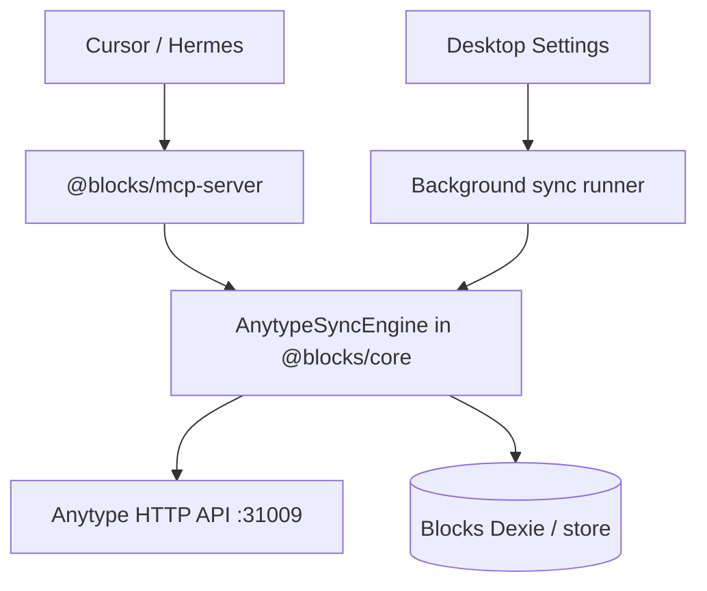

# Anytype Two-Way Task Sync (N-0050 / N-0051)

Bidirectional task sync between Blocks and a configured Anytype space. Spec lives in [ROADMAP.md](../Working%20Docs-Features-Incidents/ROADMAP.md#n-0050-anytype-two-way-task-sync); this doc covers architecture, field mapping, and workflows.

## Phase map

| Phase | Scope | Surface | Status |
|-------|-------|---------|--------|
| **A** | Core engine + MCP tools | `@blocks/core` + `@blocks/mcp-server` (agents via Cursor/Hermes) | 🔄 v26.07.16b2 |
| **B** | Desktop in-app sync | Settings panel + background runner (Electron) | 📋 Planned |
| **C** | Web in-app sync ([N-0051](../Working%20Docs-Features-Incidents/ROADMAP.md#n-0051-anytype-in-app-sync-web)) | Web Settings parity | 📋 Blocked on browser API access |

## Architecture

One shared engine in `@blocks/core` (`packages/core/src/integrations/anytype/`) talks to the local Anytype HTTP API (default `http://127.0.0.1:31009`). Both the MCP server (Phase A) and Desktop Settings (Phase B) call the same engine — mapping and merge logic exist once.

`@anyproto/anytype-mcp` remains the agent-side bridge for driving Anytype from Cursor/Hermes; Blocks never shells out to it.

## MCP tools (Phase A)

| Tool | Description |
|------|-------------|
| `push_task_to_anytype` | Push one Blocks task to the configured space (create or update linked object) |
| `pull_tasks_from_anytype` | Pull Task-type objects from the space into the Blocks store |
| `sync_linked_tasks` | Full two-way pass: pull, LWW merge, push winners |
| `export_tasks_to_anytype_markdown` | (N-0019, kept) Markdown export for manual import workflows |

Configuration (env on the `blocks` / `blocks-export` MCP entries):

| Env | Purpose |
|-----|---------|
| `ANYTYPE_API_BASE_URL` | Override API endpoint (default `http://127.0.0.1:31009`) |
| `ANYTYPE_API_KEY` | Bearer token from Anytype Settings → API Keys |
| `ANYTYPE_SPACE_ID` | Target space for sync |

## Field mapping (full parity)

| Blocks `Task` | Anytype Task object |
|---------------|---------------------|
| `name` | title / name relation |
| `description`, `notes` | body / description |
| `status` | status relation (map below) |
| `priority` | priority relation |
| `tags` | tag relations |
| `dueDate` | due date property |
| `scheduledAt` | custom date property (Blocks timeline) |
| `timeSpent`, `startedAt`, `completedAt` | custom numeric/date props |
| `subtasks` | checklist or child objects |
| `blockSize`, `blockCount`, `accessContexts` | custom relations / multi-select |
| `updatedAt` | LWW authority |

`kanbanOrder` (N-0048) and saved views (N-0049) are local presentation only — never synced.

### Status map

| Blocks | Anytype |
|--------|---------|
| `backlog` | Backlog |
| `design` | Planning |
| `todo` | To Do |
| `doing` | In Progress |
| `review` | Review |
| `done` | Done |

Unknown Anytype states map to `backlog` with a logged warning.

## Link metadata

Tasks gain optional fields (non-breaking): `anytypeObjectId`, `anytypeSpaceId`, `anytypeSyncedAt`, `anytypeSyncVersion` (LWW tie-break counter).

## Conflict model

- **Last-write-wins** on `updatedAt`, tie-broken by `anytypeSyncVersion`.
- **Schedule exception:** when Anytype wins and its `scheduledAt` would overlap existing timeline blocks, the change is gated behind `ScheduleConflictDialog` and applied via the timeline push-back engine (`buildTimelineInsertPushBackUpdates`) — never a bare `scheduledAt` write (single-focus rule, N-0021).
- **Deletes:** deleting on one side archives in Anytype and unlinks in Blocks. No mirror hard-deletes in v1.

## Agent recipe — sync my day

1. **Blocks MCP:** `sync_linked_tasks` — reconcile both stores.
2. **Anytype MCP:** search today's notes/tasks in the daily space.
3. **Blocks MCP:** `create_task` + `add_to_timeline` for anything missing; `push_task_to_anytype` to mirror it back.

See also the plan-day recipe in [HERMES_ECOSYSTEM_ARCHITECTURE.md](./HERMES_ECOSYSTEM_ARCHITECTURE.md).

## Desktop setup (Phase B)

1. Anytype Desktop running locally (v0.46+), API key created.
2. Blocks Settings → Anytype sync: paste API key, pick space/collection, set interval.
3. **Sync now** for manual runs; background sync runs while both apps are open.

API keys must never be committed to git. Phase B currently persists the key in renderer localStorage (parity with the AI provider key). **Pre-ship hardening (ROADMAP N-0050):** migrate to Electron `safeStorage` via main-process IPC before marking N-0050 ✅ Shipped.

## Web (Phase C / N-0051)

Blocked until the Anytype local API is reachable from a browser (CORS/proxy or hosted bridge). Until then, Web users sync through the `blocks-export` MCP config and Cursor/Hermes agents.

See also: [INTEGRATIONS_ANYTYPE_MCP.md](./INTEGRATIONS_ANYTYPE_MCP.md) · [INTEGRATIONS_BLOCKS_MCP.md](./INTEGRATIONS_BLOCKS_MCP.md) · [LOCAL_FIRST_ARCHITECTURE.md](./LOCAL_FIRST_ARCHITECTURE.md)
